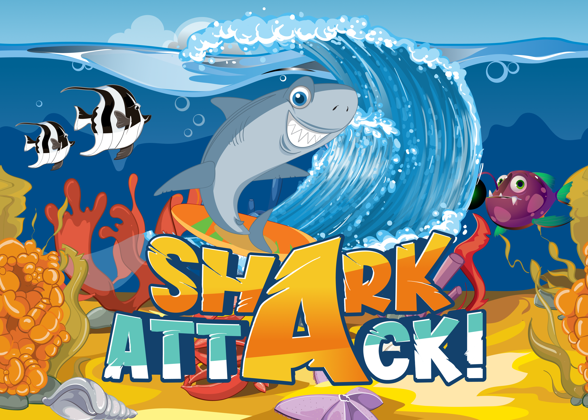
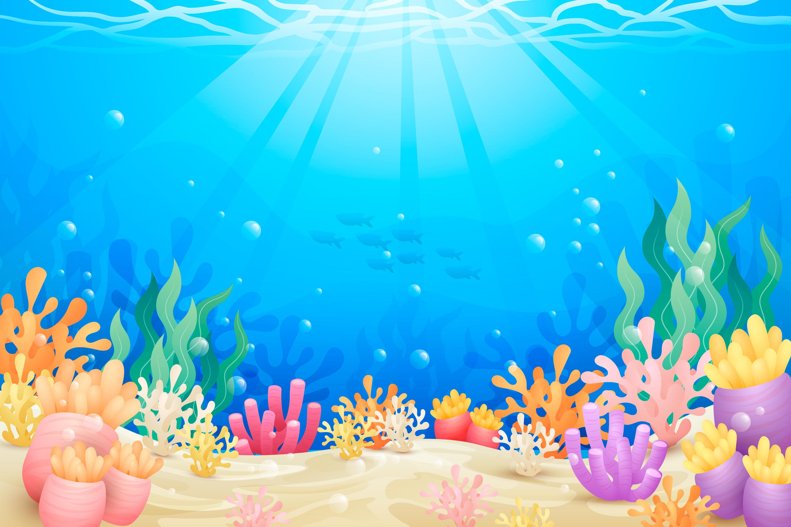
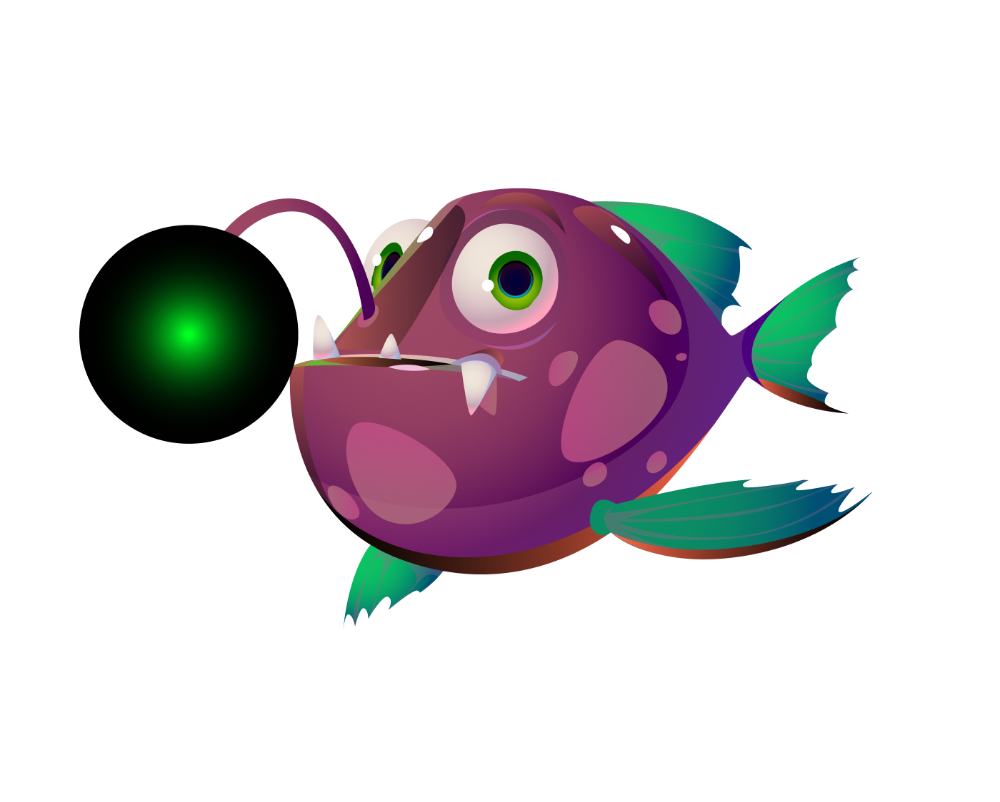
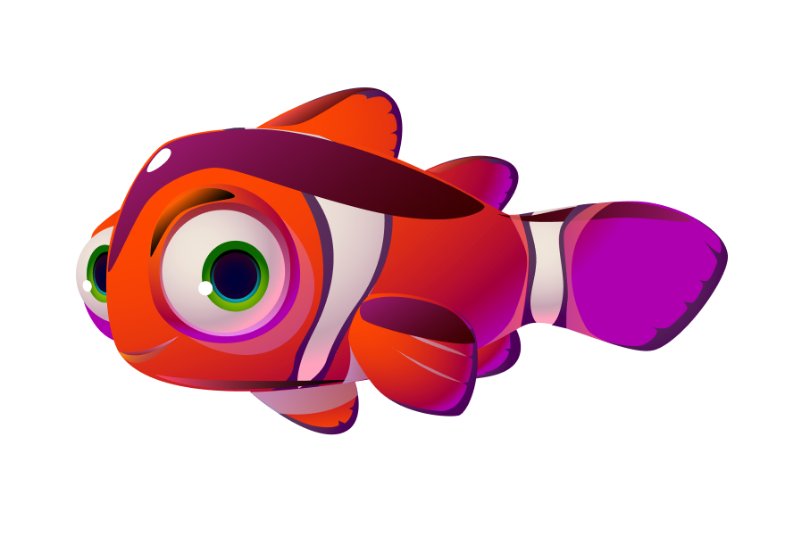
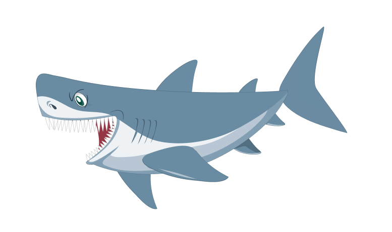
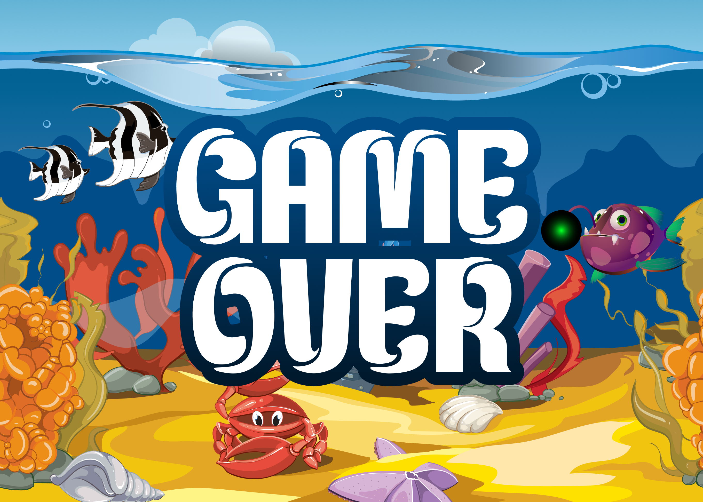

# PROJECT GAME "SHARK ATTACK"

- **Nama:** Lu'bah Al 'Aini
- **NRP:** 5024241082

---

# 1. Penjelasan Game

## 1.1 Deskripsi Umum

Shark Attack merupakan permainan interaktif berbasis pengolahan citra digital (*Advanced Image Processing*) yang dikembangkan menggunakan bahasa pemrograman Python dengan pustaka OpenCV dan NumPy. Sistem memanfaatkan webcam sebagai perangkat masukan utama untuk mendeteksi gerakan dan gestur tangan pengguna secara real-time.

Berbeda dengan permainan konvensional yang menggunakan keyboard atau mouse, kontrol pada game ini dilakukan melalui proses segmentasi warna kulit pada citra kamera. Posisi tangan yang terdeteksi digunakan untuk mengendalikan karakter ikan utama yang berada pada lingkungan bawah laut.

## 1.2 Tujuan Permainan

Tujuan permainan adalah memperoleh skor setinggi mungkin dengan memakan ikan-ikan kecil yang bergerak di dalam area permainan. Pada saat yang sama pemain harus menghindari serangan hiu yang berpatroli di bagian bawah layar.

Setiap ikan kecil yang berhasil dimakan akan memberikan tambahan skor sebesar 10 poin dan memperbesar ukuran karakter pemain secara bertahap. Permainan berakhir apabila seluruh nyawa pemain habis akibat bertabrakan dengan hiu.

---

# 2. Struktur Kode

```text
Project Folder
│
├── assets
│   ├── big_fish.png
│   ├── game_over.png
│   ├── score_place.png
│   ├── sea.jpg
│   ├── shark.png
│   ├── small_fish.png
│   └── welcome.png
│
├── sound
│   ├── bubbles.wav
│   ├── music.wav
│   └── lose.wav
│
└── main.py
```

---

# 3. Fungsi yang Dipakai

## 3.1 `manual_erode()`

Fungsi `manual_erode()` digunakan untuk melakukan operasi morfologi erosi secara manual pada citra biner dengan memanfaatkan pergeseran matriks menggunakan `np.roll`. Proses ini bekerja dengan mempertahankan piksel putih hanya apabila seluruh piksel di lingkungan kernel bernilai aktif, sehingga mampu mengikis tepi objek dan menghilangkan noise kecil yang muncul akibat kesalahan segmentasi warna kulit. Masukan fungsi berupa *binary mask* hasil segmentasi, sedangkan keluarannya adalah *binary mask* yang telah mengalami proses erosi.

## 3.2 `manual_dilate()`

Fungsi `manual_dilate()` digunakan untuk melakukan operasi morfologi dilasi secara manual pada citra biner dengan memperluas area piksel putih berdasarkan nilai piksel di lingkungan kernel yang diperiksa menggunakan `np.roll`. Operasi ini berfungsi untuk mengembalikan bagian objek yang terkikis selama proses erosi sekaligus menutup lubang-lubang kecil pada area tangan sehingga menghasilkan bentuk objek yang lebih utuh dan stabil. Masukan fungsi berupa *binary mask* hasil segmentasi atau hasil erosi, sedangkan keluarannya adalah *binary mask* yang telah mengalami proses dilasi.

## 3.3 `overlay_sprite()`

Fungsi `overlay_sprite()` digunakan untuk menempelkan objek grafis berformat PNG ke atas gambar latar belakang permainan dengan memanfaatkan informasi transparansi (*alpha channel*). Fungsi ini melakukan proses *alpha blending* sehingga sprite dapat menyatu dengan latar tanpa menampilkan area latar belakang gambar PNG yang tidak diinginkan. Pada permainan ini fungsi digunakan untuk menampilkan karakter ikan pemain, ikan kecil, hiu, panel skor, serta berbagai elemen visual lainnya. Masukan fungsi berupa gambar latar belakang, gambar sprite, dan koordinat pusat objek, sedangkan keluarannya berupa frame hasil komposit yang siap ditampilkan ke layar.

## 3.4 `draw_ui()`

Fungsi `draw_ui()` digunakan untuk menampilkan berbagai elemen teks antarmuka permainan (*User Interface*) seperti skor, notifikasi aksi, maupun pesan permainan. Untuk meningkatkan keterbacaan, fungsi menggambar teks dalam dua lapisan, yaitu lapisan bayangan berwarna gelap dan lapisan utama berwarna terang di atasnya. Teknik ini menghasilkan efek kontras yang membuat teks tetap mudah dibaca meskipun ditampilkan pada latar belakang yang kompleks dan berwarna-warni.

## 3.5 `draw_heart()`

Fungsi `draw_heart()` digunakan untuk menggambar ikon hati sebagai indikator jumlah nyawa pemain secara real-time. Bentuk hati dibangun menggunakan kombinasi dua buah lingkaran dan satu buah poligon segitiga yang dirender langsung pada frame permainan menggunakan fungsi-fungsi grafis OpenCV. Pendekatan ini memungkinkan indikator nyawa ditampilkan tanpa memerlukan aset gambar tambahan sehingga lebih ringan dan fleksibel untuk diubah ukurannya.

## 3.6 `play_bgm_loop()`

Fungsi `play_bgm_loop()` digunakan untuk mengelola pemutaran musik latar permainan secara terus-menerus menggunakan mekanisme *multithreading*. Dengan menempatkan proses audio pada thread terpisah, pemutaran musik tidak akan menghambat proses akuisisi frame kamera, segmentasi citra, maupun rendering permainan. Fungsi ini memastikan pengalaman bermain tetap responsif sekaligus menjaga musik latar tetap diputar secara berulang selama permainan berlangsung.

---

# 4. Hand Gesture

Sistem pengenalan gestur pada permainan Shark Attack dilakukan melalui pendekatan pengolahan citra klasik yang terdiri atas segmentasi warna kulit, pembersihan noise menggunakan operasi morfologi, serta analisis karakteristik geometris objek tangan yang terdeteksi. Pendekatan ini dipilih karena lebih ringan secara komputasi dan sesuai dengan tujuan pembelajaran pada mata kuliah Pengolahan Citra dan Video.

## 4.1 Segmentasi Warna Kulit

Tahap pertama dalam proses pengenalan gestur adalah melakukan segmentasi warna kulit pada area *Region of Interest* (ROI) yang telah ditentukan. Setiap frame yang diperoleh dari webcam dikonversi terlebih dahulu dari ruang warna BGR ke HSV karena ruang warna HSV lebih stabil terhadap perubahan intensitas pencahayaan dibandingkan ruang warna RGB. Piksel dengan nilai HSV yang berada pada rentang warna kulit akan diberi nilai putih (255), sedangkan piksel lainnya diberi nilai hitam (0), sehingga menghasilkan citra biner yang merepresentasikan objek tangan pengguna.

```python
lower_skin = [0, 30, 60]
upper_skin = [20, 255, 255]
```

Hasil segmentasi kemudian diproses lebih lanjut menggunakan operasi erosi dan dilasi untuk mengurangi noise dan menghasilkan bentuk tangan yang lebih solid sebelum dilakukan ekstraksi fitur.

## 4.2 Gesture Tangan Terbuka (Open Hand)

Gesture tangan terbuka digunakan sebagai mode navigasi utama dalam permainan. Deteksi dilakukan dengan menghitung standar deviasi koordinat horizontal seluruh piksel kulit yang tersegmentasi menggunakan persamaan berikut:

```python
x_spread = np.std(x_indices)
```

Ketika jari-jari tangan direntangkan, distribusi piksel akan menyebar lebih luas sehingga menghasilkan nilai standar deviasi yang relatif besar. Sistem mengklasifikasikan kondisi tersebut sebagai gesture tangan terbuka apabila nilai `x_spread` lebih besar atau sama dengan 35. Pada kondisi ini, koordinat centroid tangan dipetakan ke posisi karakter ikan menggunakan metode *movement smoothing* sehingga pergerakan karakter terlihat lebih halus dan natural.

```python
x_spread >= 35
```

## 4.3 Gesture Kepalan Tangan (Closed Fist)

Gesture kepalan tangan digunakan untuk mengaktifkan mekanisme memakan ikan (*eating mode*). Ketika tangan mengepal, jari-jari menjadi lebih rapat sehingga distribusi piksel horizontal menyempit dan menghasilkan nilai standar deviasi yang lebih kecil. Sistem akan mengaktifkan status `is_eating = True` apabila nilai `x_spread` berada di bawah ambang batas yang telah ditentukan.

```python
x_spread < 35
```

Saat mode ini aktif, karakter ikan dapat memakan ikan kecil yang berada di dalam radius *collision* tertentu. Setiap ikan yang berhasil dimakan akan menambah skor sebesar 10 poin, memperbesar ukuran karakter secara bertahap, serta memunculkan efek visual berupa tulisan "CHOMP!" pada layar permainan.


---

# 5. Cara Bermain

1. Jalankan program dan pastikan webcam aktif.
2. Letakkan tangan pada area deteksi yang tersedia.
3. Gunakan tangan terbuka untuk menggerakkan ikan.
4. Dekati ikan kecil yang muncul pada layar.
5. Lakukan kepalan tangan untuk memakan ikan kecil.
6. Hindari tabrakan dengan hiu.
7. Gunakan gestur angka satu apabila ingin melakukan Escape Dash.
8. Kumpulkan skor sebanyak mungkin sebelum seluruh nyawa habis.

---

# 6. Cara Menjalankan Program

## Instalasi Dependensi

```bash
pip install opencv-python numpy
```

---

## Menjalankan Program

Masuk ke direktori proyek kemudian jalankan:

```bash
python main.py
```

Untuk keluar dari permainan tekan tombol:

```text
q
```

---

# 7. Asset Gallery

## Aset Gambar

<table>
<tr>
<td align="center">

Welcome Screen



</td>

<td align="center">

Sea Background



</td>
</tr>

<tr>
<td align="center">

### Big Fish



</td>

<td align="center">

### Small Fish



</td>
</tr>

<tr>
<td align="center">

### Shark



</td>

<td align="center">

### Game Over



</td>
</tr>
</table>

## Aset Audio

| Nama File   | Fungsi                   |
| ----------- | ------------------------ |
| bubbles.wav | Efek suara layar pembuka |
| music.wav   | Musik latar permainan    |
| lose.wav    | Efek suara kekalahan     |

---

# 8. Dokumentasi Video Demo

```
Masukkan tautan video demonstrasi di sini
```